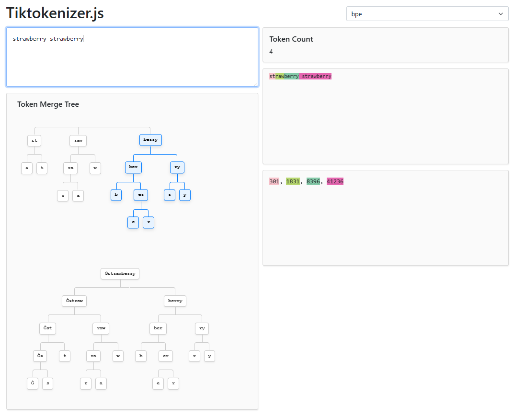

# Tiktokenizer.js

Tiktokenizer-js is a tokenizer visualizer written in pure JavaScript that mirrors the functionality of [OpenAI's GPT-2/GPT-3 BPE tokenizer](https://platform.openai.com/tokenizer) to showcase how text is tokenized into subword units. As explained in [Karpathy's GPT Tokenizer Video](https://www.youtube.com/watch?v=zduSFxRajkE), this implementation uses the official `encoder.json` and `vocab.bpe` files provided by OpenAI, ensuring that token IDs exactly match the official GPT-2/GPT-3 representation. Check it out at [Tiktokenizer.js](https://sinjoysaha.github.io/tiktokenizer-js/) 🚀.

Try different characters including ASCII, emojis, and non-English languages! Check out how it compares to the [official tokenizer](https://platform.openai.com/tokenizer) 😎.

## Features

- **Exact GPT-2/3 Matching**: Uses the official `encoder.json` and `vocab.bpe` to ensure token IDs match OpenAI's models perfectly.
- **Real-time Tokenization**: Instant feedback as you type, with color-coded highlighting of tokens.
- **Token Merge Tree**: A visualization of the BPE algorithm showing the step-by-step merging process of characters into final BPE tokens with hover highlights and interactive ancestry paths.
- **Unicode & Emoji Support**: Correctly handles multi-byte characters and complex symbols.
- **No Dependencies**: Built with vanilla JavaScript and Bootstrap 5 for styling. No heavy framework or backend required.

## How it Works

The project implements the BPE algorithm from scratch in `app.js`:
1. **Regex Splitting**: Uses the same regex pattern as GPT-2/3 to split text into initial chunks.
2. **Byte Encoding**: Maps bytes to a specific set of Unicode characters to ensure all characters (including spaces and control codes) can be processed consistently.
3. **Iterative Merging**: Repeatedly finds the most frequent pair of adjacent tokens (based on pre-calculated ranks) and merges them until no more merges are possible.
4. **Visualization**: Generates a CSS-based tree structure to show the lineage of each merged token.

## Project Structure

- `index.html`: The main interface and structure.
- `app.js`: Core logic for BPE encoding and tree generation.
- `style.css`: Custom styles, including the hierarchical tree visualization.
- `data/`: Contains the official OpenAI tokenizer files.
  - `encoder.json`: Mapping of tokens to IDs.
  - `vocab.bpe`: Ranked list of merges.

## Contributing

Contributions are welcome! If you'd like to add support for other tokenizer schemes, feel free to open a PR.

---

Go to [Tiktokenizer.js](https://sinjoysaha.github.io/tiktokenizer-js/) to try it out.

Inspired by [Tiktokenizer](https://tiktokenizer.vercel.app/).
